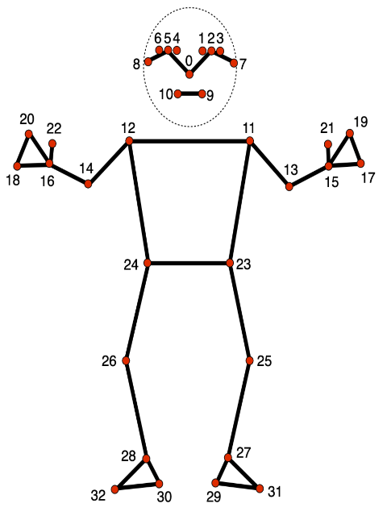
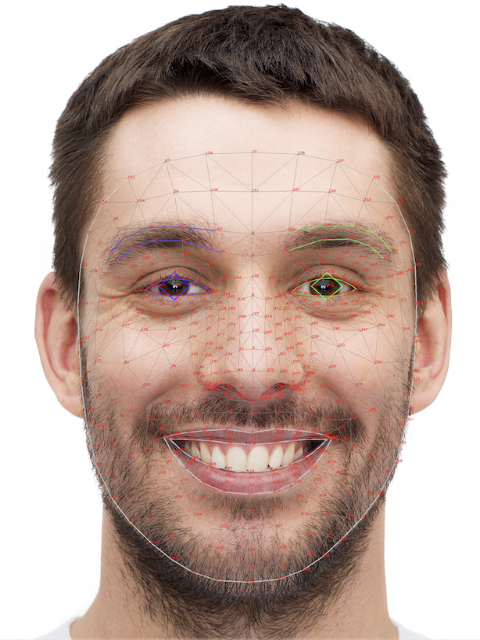

**An interactive version of Colab notebook for pose estimation and angle calculation** [](https://colab.research.google.com/drive/1Q_7BwaDciIt0jn52GkcOlLqD8cq0uFFj?usp=sharing)


# **Pose Estimation**
Pose estimation is a computer vision technique that detects and monitors the position and orientation of human bodies in images or videos. It operates by recognizing critical anatomical points (joints) and utilizing their spatial relationships to infer the body's pose. 

in simple way it can be represented as detecting the skeleton of a human of an object. Essentially, it is a method of capturing a collection of coordinates by identifying human body joints such as the wrist, shoulder, knees, eyes, ears, ankles, and arms, which are important points in photos and movies that represent a person's position.


The pose estimator model subsequently generates the coordinates of the detected body parts and joints as output and a confidence score that indicates the precision of the estimations. Pose estimation is used in numerous domains, including animation, sports analysis, medical applications, and human-computer interaction.

Over the time, several approaches used in this domain, some of them are pure mathemetical and later on feature based. Now a lot of models are developed in recent years for pose estimations. like: `MediaPipe Pose`, [`OpenPose`](https://github.com/CMU-Perceptual-Computing-Lab/openpose), [`AlphaPose`](https://github.com/MVIG-SJTU/AlphaPose), Also with   [`YOLO`](https://docs.ultralytics.com/tasks/pose/) Varrients.

**The Direct Linear Transform (DLT):**

The Direct Linear Transform (DLT) algorithm is a method used for estimating the pose of a camera or object in 3D space. It is commonly used in computer vision for camera calibration, 3D reconstruction, and pose estimation. The DLT algorithm uses correspondences between 3D world points and their 2D image projections to estimate the transformation matrix that describes the pose. The DLT algorithm requires some predefined values. Start by the 3D positions of a few real-world points. For instance, measure scene markers or objects' coordinates. Second, the camera's 2D image to locate those locations in 2D space. You mark those image points. Then solve some linear algebric equation to get the estimated pose. you can understand more from : [link](https://blog.roboflow.com/pose-estimation-algorithms-history/#:~:text=Direct%20Linear%20Transform%20(DLT)%20Algorithm)


 
**Recent development in automated pose estimation:**

There are some State of The Art model for pose estimation. Some of them works in multiple stage, like [`Mediapipe Pose`](https://ai.google.dev/edge/mediapipe/solutions/vision/pose_landmarker?ref=blog.roboflow.com) works in 2 stage, called detection and tracking. It uses a series of models. The first model detects the presence of human bodies within an image frame, and the second model locates key points on the bodies.

On the other hand, YOLO models uses single stage model for pose estimation. 


There are some great models developed for pose estimation with some great feature like real-time implementation even in the on-board chip or edge devices:
# Note on Pose Estimation Models

Pose estimation involves the detection and tracking of human body parts and their positions in images or videos. This technology has various applications, including augmented reality, sports analysis, human-computer interaction, and healthcare. Here are some popular pose estimation models, many of which have licenses permitting commercial use:

## OpenPose [GitHub](https://github.com/CMU-Perceptual-Computing-Lab/openpose)
- **Description**: OpenPose is one of the first and most widely used pose estimation models. It can detect multi-person keypoints in real-time, covering body, foot, hand, and facial keypoints.
- **License**: OpenPose is licensed under the Apache 2.0 License, allowing for commercial use.
- **Key Features**: Real-time multi-person detection, high accuracy, extensive documentation and community support.

## MediaPipe Pose [GitHub](https://github.com/google/mediapipe)
- **Description**: Developed by Google, MediaPipe Pose offers high-fidelity body pose tracking. It uses BlazePose, which is optimized for both accuracy and speed.
- **License**: MediaPipe is licensed under the Apache 2.0 License, making it suitable for commercial applications.
- **Key Features**: Cross-platform support, lightweight and fast, integrates well with other MediaPipe solutions.

## HRNet (High-Resolution Network) [GitHub](https://github.com/HRNet)
- **Description**: HRNet maintains high-resolution representations through the entire network, leading to high accuracy in pose estimation tasks.
- **License**: HRNet is released under the MIT License, permitting commercial use.
- **Key Features**: High accuracy, robustness to occlusions, widely adopted in academia and industry.

## DeepLabCut [GitHub](https://github.com/DeepLabCut/DeepLabCut)
- **Description**: Initially developed for animal pose estimation, DeepLabCut has also been adapted for human pose estimation. It is based on transfer learning with deep neural networks.
- **License**: DeepLabCut is licensed under the GNU General Public License v3.0 (GPL-3.0), which allows for commercial use under specific conditions.
- **Key Features**: High flexibility, strong performance in domain-specific applications, extensive customization options.

## PoseNet [GitHub](https://github.com/tensorflow/tfjs-models/tree/master/posenet)
- **Description**: PoseNet, developed by Google, offers lightweight and real-time human pose estimation. It can be run in a web browser using TensorFlow.js.
- **License**: PoseNet is available under the Apache 2.0 License, suitable for commercial use.
- **Key Features**: Real-time performance, easy integration with web technologies, well-suited for mobile applications.

## AlphaPose [GitHub](https://github.com/MVIG-SJTU/AlphaPose)
- **Description**: AlphaPose aims to achieve high accuracy in human pose estimation and tracking. It uses a top-down approach to handle multi-person pose estimation.
- **License**: AlphaPose is licensed under the Apache 2.0 License, allowing for commercial use.
- **Key Features**: High accuracy, real-time performance, robust multi-person detection.

## DensePose [GitHub](https://github.com/facebookresearch/DensePose)
- **Description**: Developed by Facebook AI, DensePose maps all human pixels in an image to the 3D surface of the human body. It provides dense correspondences between image pixels and 3D body models.
- **License**: DensePose is licensed under the Apache 2.0 License, enabling commercial use.
- **Key Features**: Dense and detailed pose estimation, useful for 3D reconstruction and AR applications.

These models are the state of the art in pose estimation, providing robust solutions for various applications. Every model has their own working principles. 


# The iner-working of a pose estimation model
**``MediaPipe Pose``** :


In the domain of pose estimation Google's MediaPipe pose is one of the awesome model. although it works on two stage, it has different versions for full body pose estimation as well as Facial pose estimation. For full body estimation it draws 33 points over different joints. here is an image containing the 33 points. One thing to add here is to it predicts 3 dimensional points for each points.  


For face detection the model is even more complex.The MediaPipe Face Landmarker task detects facial landmarks and expressions in videos and images. Create virtual avatars, identify human facial expressions, and add facial filters and effects with this challenge. Machine learning (ML) models can process single or continuous images in this task. It creates 3-dimensional face landmarks, blendshape scores (facial expression coefficients) to infer complex facial surfaces in real time, and transformation matrices for effects rendering.

Heres some functionalities of the model:
The following models are packaged together into a downloadable model bundle:

* Face detection model: detects the presence of faces with a few key facial landmarks.

* Face mesh model: adds a complete mapping of the face. The model outputs an estimate of 478 3-dimensional face landmarks.

* Blendshape prediction model: receives output from the face mesh model predicts 52 blendshape scores, which are coefficients representing facial different expressions.

Heres a cool example from Google:



MediaPipe Pose performs full-body pose estimation in real-time. It can identify 33 key points (landmarks) on the body, including the face, hands, feet, and major joints. The pipeline processes video frames to detect these landmarks and outputs their 2D coordinates.

## Components of MediaPipe Pose

1. **Pose Detection**: A detector that identifies the presence and location of a person in the image.
2. **Pose Landmark Model**: A more detailed model that takes the cropped image (focused on the person) and detects the precise landmarks.

## Working Principle

### 1. Pose Detection
This initial step involves detecting the region of interest (ROI) where the person is located. MediaPipe uses a lightweight detector, typically a neural network, to find the bounding box around the person.

- **Input**: The full image or video frame.
- **Output**: A bounding box around the detected person.

### 2. ROI Extraction
Once the bounding box is determined, the region inside the bounding box is extracted and resized to a standard size suitable for the landmark model. This helps in maintaining consistent input dimensions for the next stage.

### 3. Pose Landmark Model
This model processes the cropped and resized image to identify precise landmarks. It’s a more sophisticated model that outputs the coordinates of 33 key points on the body.

- **Input**: The cropped image containing the person.
- **Output**: 33 landmarks with x, y coordinates (and z coordinates in 3D models).

### 4. Landmark Refinement
The detected landmarks are often refined using techniques like filtering to smooth out the positions over time and reduce jitter in the estimations.

## Pipeline Details

### Preprocessing
The input image is normalized and resized. This preprocessing step is crucial for maintaining consistent model performance.

### Model Inference
The normalized image is passed through the pose detection model to get the bounding box, followed by the landmark model to get the key points. The models used are usually convolutional neural networks (CNNs), trained on large datasets of human poses.

### Post-processing
The raw outputs from the landmark model are post-processed to improve accuracy. This includes applying filters like the Kalman filter or one-Euro filter to smooth the landmark coordinates over time.

### Rendering
The final step is rendering the detected landmarks on the original image. This involves drawing lines and points to visualize the pose.

## Models and Architecture

- **Pose Detection Model**: Typically a lightweight CNN model, optimized for speed and efficiency to run on various platforms including mobile devices.
- **Pose Landmark Model**: A more complex CNN that accurately detects and localizes the landmarks within the detected region. Often, it includes multiple layers with residual connections to improve accuracy and generalization.


Heres an example use with webcam:
```python
import cv2
import mediapipe as mp

# Initialize MediaPipe Pose
mp_pose = mp.solutions.pose
pose = mp_pose.Pose()
mp_drawing = mp.solutions.drawing_utils

# Open webcam
cap = cv2.VideoCapture(0)

while cap.isOpened():
    ret, frame = cap.read()
    if not ret:
        break

    # Convert the image to RGB
    image = cv2.cvtColor(frame, cv2.COLOR_BGR2RGB)

    #detect landmarks
    results = pose.process(image)

    # Draw the pose annotation
    image = cv2.cvtColor(image, cv2.COLOR_RGB2BGR)
    if results.pose_landmarks:
        mp_drawing.draw_landmarks(
            image, results.pose_landmarks, mp_pose.POSE_CONNECTIONS)

    # Display the image
    cv2.imshow('MediaPipe Pose', image)

    if cv2.waitKey(10) & 0xFF == ord('q'):
        break

cap.release()
cv2.destroyAllWindows()
```

